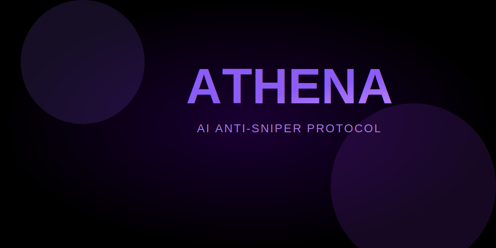

<div align="center">

<picture>
  <source media="(prefers-color-scheme: dark)" srcset="./assets/hero-dark.svg">
  <source media="(prefers-color-scheme: light)" srcset="./assets/hero-dark.svg">
  
</picture>

AI-powered anti-sniper market maker for Solana. Protects traders from bot exploitation during token launches.


</div>

## Features


- Real-time sniper detection AI
- Custom AMM with anti-bot logic
- Wallet reputation system
- Fair launch mechanics
- Dynamic slippage protection

## Architecture

```
athena-amm/
├── ai-model/          # Sniper detection neural network
├── program/           # Solana smart contract (Anchor)
├── agent/             # Autonomous monitoring agent
├── frontend/          # Dashboard UI
└── docs/              # Technical documentation
```

## Tech Stack

- Solana (Anchor Framework)
- Python (TensorFlow/PyTorch)
- TypeScript/React
- WebGL for graphics

## Status

In development. Building the future of fair DeFi.
