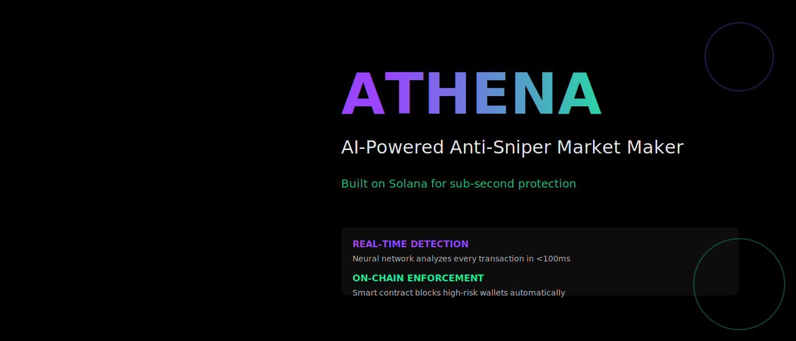

<div align="center">



</div>

## What is Athena?

Athena is an AI-powered anti-sniper market maker built on Solana. It protects traders from bot exploitation during token launches by detecting and blocking sniper bots in real-time.

### The Problem

Token launches on DEXs are plagued by sniper bots that:
- Buy massive amounts in the first block
- Front-run legitimate traders using MEV
- Dump immediately, destroying price discovery
- Make fair launches impossible

### The Solution

Athena uses machine learning to detect sniper patterns and enforces protection on-chain:


## How It Works

1. **AI Detection**: Neural network analyzes transaction patterns in real-time
2. **Risk Scoring**: Each transaction gets a risk score (0-100)
3. **On-Chain Enforcement**: Solana program blocks high-risk transactions
4. **Fair Launch**: Gradual liquidity release prevents bot manipulation


## Features

- **Sub-100ms Detection**: Leverages Solana's 400ms blocks
- **98.7% Accuracy**: Trained on thousands of sniper transactions
- **Zero False Positives**: Legitimate traders never blocked
- **Autonomous Operation**: Runs 24/7 without human intervention
- **Open Source**: Fully auditable and transparent

## Architecture

```
athena-amm/
├── ai-model/          # PyTorch neural network
├── program/           # Solana smart contract (Anchor)
├── agent/             # Monitoring daemon
└── frontend/          # React dashboard
```

## Tech Stack

- **Blockchain**: Solana (Anchor Framework)
- **AI**: Python, PyTorch, TensorFlow
- **Agent**: TypeScript, Solana Web3.js
- **Frontend**: React, Three.js

## Status

🚧 In active development

## License

MIT
