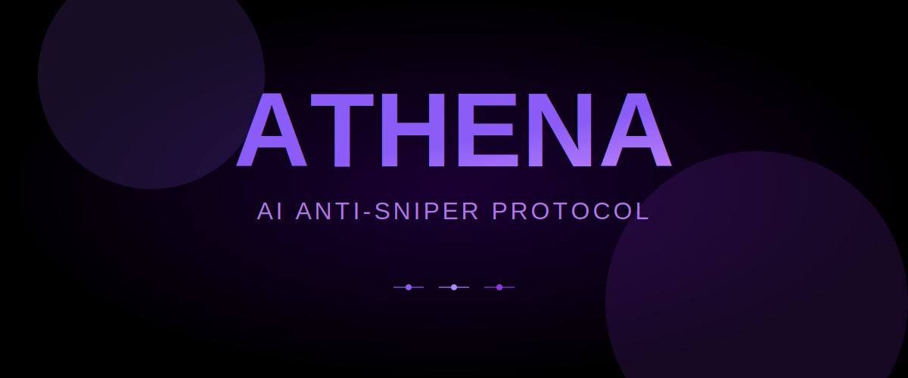
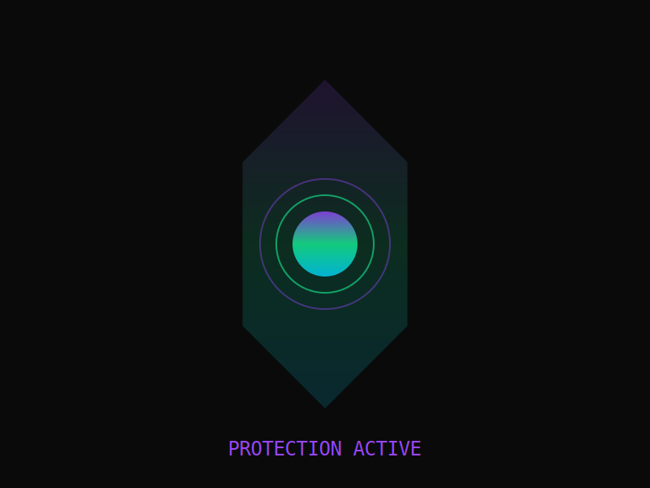

<div align="center">



AI-powered anti-sniper market maker for Solana. Protects traders from bot exploitation during token launches.



</div>

## What It Does

Athena detects and blocks sniper bots in real-time using AI pattern recognition. Built on Solana's 400ms blocks to react faster than any bot.

## Features



- Real-time sniper detection AI
- Custom AMM with anti-bot logic
- Wallet reputation system
- Fair launch mechanics
- Dynamic slippage protection

## Architecture

```
athena-amm/
├── ai-model/          # Sniper detection neural network
├── program/           # Solana smart contract (Anchor)
├── agent/             # Autonomous monitoring agent
├── frontend/          # Dashboard UI
└── docs/              # Technical documentation
```

## Tech Stack

- Solana (Anchor Framework)
- Python (TensorFlow/PyTorch)
- TypeScript/React
- WebGL for graphics

## Status

In development. Building the future of fair DeFi.
